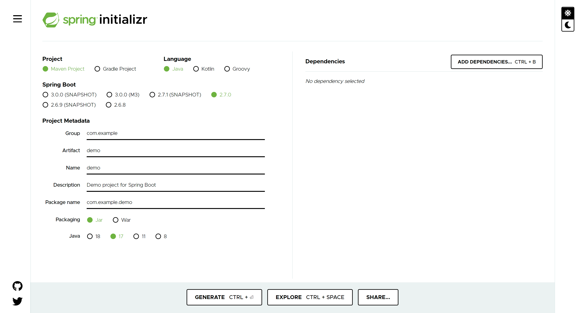
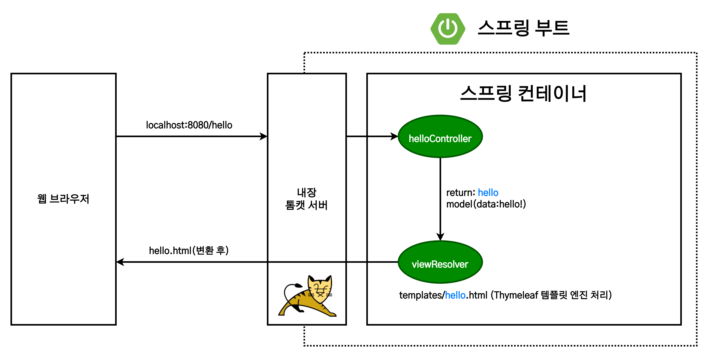

# 스프링 입문 : 프로젝트 환경설정

1. [개발 환경](#개발-환경)
2. [프로젝트 생성](#프로젝트-생성)
3. [라이브러리 살펴보기](#라이브러리-살펴보기)
4. [View 환경설정](#view-환경설정)
   1. [Welcome Page 만들기](#welcome-page-만들기)
5. [빌드하고 실행하기](#빌드하고-실행하기)

## 개발 환경

- Java 11 이상
- IDE : IntelliJ 또는 Eclipse

## 프로젝트 생성



- [스프링 부트 스타터](https://start.spring.io)  
  스프링 부트 기반의 프로젝트를 생성해주는 공식 사이트.
- [스프링 가이드](https://spring.io/guides)  
  스프링 프로젝트 개발시 참고하면 좋은 공식 홈페이지의 안내서들.

프로젝트를 생성할 때 지정해야 하는 구성요소는 다음과 같다.

- `Project`  
  `Maven`과 `Gradle` 중 원하는 프로젝트 **빌드 관리 도구**. 최근에는 `Gradle`을 주로 사용하는 추세.
- `Language`  
  프로젝트에서 사용할 프로그래밍 언어.
- `Spring Boot`  
  사용할 `Spring Boot`의 버전 선택.
  - 넘버링 버전만 기술 : 정식 출시된 버전.
  - `SNAPSHOT` : 아직 제작중인 버전.
  - `M1, M2, M3` 등 : 아직 정식 릴리즈되지 않은 버전.
- `Project Meta`  
  프로젝트의 메타 데이터.
  - `Group`  
    대부분의 경우 기업 도메인명.
  - `Artifact`  
    빌드 결과물명.
- `Java` : `Java`를 사용할 경우, 사용할 언어의 버전.
- `Dependencies`  
  사용하려는 라이브러리 종속성 목록.
  - `Spring Web` : RESTful을 포함한 스프링 MVC 구조의 웹을 제작할 때 사용. Tomcat 서버를 자체 내장.
  - `Thymeleaf` : HTML을 작성해주는 템플릿 엔진.

원하는 구성요소 설정을 마친 후 `Generate` 버튼을 통해 프로젝트를 생성할 수 있다.

프로젝트의 `src` 디렉터리에는 `main`과 `test`가 분리되어 있다. 실제 `java` 파일들과 리소스 파일들은 `main` 디렉터리에, 테스트 코드들은 `test` 디렉터리에 분리하여 위치하게 된다.

생성된 프로젝트의 종속성 설정은 프로젝트 내부의 `build.gradle` 파일에서 확인할 수 있다.

```gradle
plugins {
	id 'org.springframework.boot' version '2.7.0'
	id 'io.spring.dependency-management' version '1.0.11.RELEASE'
	id 'java'
}

group = 'hello'
version = '0.0.1-SNAPSHOT'
sourceCompatibility = '11'

repositories {
	mavenCentral()
}

dependencies {
	implementation 'org.springframework.boot:spring-boot-starter-thymeleaf' //타임리프
	implementation 'org.springframework.boot:spring-boot-starter-web'       //스프링 WEB
	testImplementation 'org.springframework.boot:spring-boot-starter-test'
}

tasks.named('test') {
	useJUnitPlatform()
}
```

`src/main/java/hello.hellospring/HelloSpringApplication.java`를 실행하면 수많은 로그가 찍혀 나오는데, 그 중 눈여겨 봐야 하는 부분은 다음과 같다.

```
2022-06-20 18:01:29.811  INFO 24120 --- [           main] o.s.b.w.embedded.tomcat.TomcatWebServer  : Tomcat initialized with port(s): 8080 (http)
//8080포트로 HTTP 서버를 실행.
```

## 라이브러리 살펴보기

`Gradle`과 `Maven`은 의존관계가 있는 라이브러리를 함께 다운로드한다. 간단하게 말하면, 우리가 A라는 라이브러리를 필요로 할 때, A를 사용하기 위해 사전 요구되는 여러 라이브러리를 알아서 다운로드하는 역할을 `Gradle`이나 `Maven`과 같은 빌드 관리 도구들이 담당한다는 말이다.

- **스프링 부트 라이브러리**
  - `spring-boot-starter-web`
    - `spring-boot-starter-tomcat` : 톰캣(웹서버)
    - `spring-webmvc` : 스프링 웹 MVC
  - `spring-boot-starter-thymeleaf` : 타임리프 템플릿 엔진(View)
  - `spring-boot-starter`(공통) : 스프링 부트 + 스프링 코어 + 로깅
    - `spring-boot`
      - `spring-core`
    - `spring-boot-starter-logging` : 개발시에는 단순 출력보다 로그가 권장됨
      - `logback`, `slf4j`
- **테스트 라이브러리**
  - `spring-boot-starter-test`
    - `junit` : 테스트 프레임워크
    - `mockito` : 목 라이브러리
    - `assertj` : 테스트 코드를 좀 더 편하게 작성하도록 도와주는 라이브러리
    - `spring-test` : 스프링 통합 테스트 지원

## View 환경설정

### Welcome Page 만들기

```html
<!--resources/static/index.html-->
<!DOCTYPE html>
<html>
  <head>
    <title>Hello</title>
    <meta http-equiv="Content-Type" content="text/html; charset=UTF-8" />
  </head>
  <body>
    Hello
    <a href="/hello">hello</a>
  </body>
</html>
```

- 스프링 부트가 제공하는 Welcome Page 기능
  - `static/index.html`을 올려두면 Welcome page 기능을 제공한다. [스프링부트 메뉴얼](https://docs.spring.io/spring-boot/docs/2.3.1.RELEASE/reference/html/spring-boot-features.html#boot-features-spring-mvc-welcome-page)
- thymeleaf 템플릿 엔진
  - 템플릿 엔진은 정적 페이지를 원하는대로 동적으로 구성하도록 도와주는 엔진.
  - 스프링 부트에서는 Thymeleaf 외에도 FreeMarker, Groovy, Mustache 템플릿 엔진들을 지원한다.
  - [thymeleaf 공식 사이트](https://www.thymeleaf.org)
  - [스프링 공식 튜토리얼](https://spring.io/guides/gs/serving-web-content/)
  - [스프링부트 메뉴얼](https://docs.spring.io/spring-boot/docs/2.3.1.RELEASE/reference/html/spring-boot-features.html#boot-features-spring-mvc-template-engines)

```java
@Controller
public class HelloController {

  @GetMapping("Hello")
  public String hello(Model model) {
    model.addAttribute("data", "hello!!");
    return "hello";
  }
}
```

```html
<!--resources/templates/hello.html-->
<!DOCTYPE html>
<html xmlns:th="http://www.thymeleaf.org">
  <head>
    <title>Hello</title>
    <meta http-equiv="Content-Type" content="text/html; charset=UTF-8" />
  </head>
  <body>
    <p th:text="'안녕하세요. ' + ${data}">안녕하세요. 손님</p>
  </body>
</html>
```

스프링 부트의 동작 과정은 아래와 같다.



1. 웹브라우저의 `localhost:8080/hello` URL 요청을 톰캣 서버에서 받는다.
2. 톰캣 서버는 전체 URL 중 `/hello`를 스프링에게 전달한다.
3. 스프링은 전달된 URL와 매칭되는 컨트롤러 메소드를 실행한다.
4. 스프링은 `Model`에 `data: "hello!"` 의 키:값 쌍을 가지는 데이터를 담는다.
5. 스프링은 렌더링 할 파일명을 리턴한다. (`resources/template/hello.html`으로 이동해서 렌더링)  
   스프링 부트는 기본값으로 `resources/templates` 디렉터리에서 파일을 찾으므로, 이에 맞추어 상대경로를 지정해야 한다.
   - 컨트롤러에서 리턴 값으로 문자를 반환하면 뷰 리졸버(`viewResolver`)가 화면을 찾아서 처리한다.
     - 스프링 부트 템플릿 엔진 기본 viewName 매핑
     - `resources:templates/` + {ViewName} + `.html`

> **참고**  
> `spring-boot-devtools` 라이브러리를 추가하면, `html` 파일을 컴파일만 해주면 서버 재시작 없이 View 파일 변경이 가능하다.  
> IntelliJ 컴파일 방법 : 메뉴 build > Recompile

## 빌드하고 실행하기

1. 콘솔로 프로젝트 디렉터리로 이동.
2. `./gradlew build`
3. `cd build/libs`
4. `java -jar hello-spring-0.0.1-SNAPSHOT.jar`
5. 실행 확인
6. 문제 발생시 `./gradlew clean build` 수행. (build 디렉터리를 완전히 지우고 다시 빌드)
